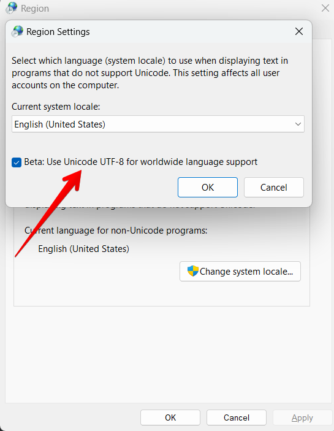

# Planned Power Outage

jBang script for identifying potential Greek power outages in your area

## Requirements

1. Install `jBang` based on the guidelines [here](https://www.jbang.dev/documentation/guide/latest/installation.html)

## Prerequisites
1. Navigate to the official [Deddie website](https://siteapps.deddie.gr/outages2public) where planned power outages are announced
2. Select the area that you are interested in and identify its `PrefectureID` and `MunicipalityID`

3. In case your OS is Windows, make sure that your terminal encoding is set to UTF-8


## Run
Execute `jBang PlannedPowerOutage.java -h` to view CLI's options

### Execution example
1. List all planned power outages in prefecture with id `21` (Heraklion) and municipality with id `413` (Heraklion)
```
jBang PlannedPowerOutage.java -p 21 -m 413
```
2. List all planned power outages in prefecture with id `21` (Heraklion) and municipality with id `413` (Heraklion) and more specifically for the area "Βασιλείες" and "Γιούχτα"
```
jBang PlannedPowerOutage.java -p 21 -m 413 Βασιλείες Γιούχτα
```