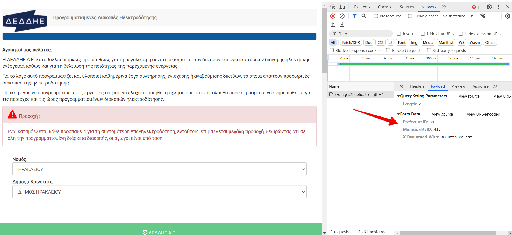

# Planned Power Outage

jBang script for identifying potential Greek power outages in your area

## Requirements

1. Install `jBang` based on the guidelines [here](https://www.jbang.dev/documentation/guide/latest/installation.html)

## Configuration
1. Navigate to the official [Deddie website](https://siteapps.deddie.gr/outages2public) where planned power outages are announced
2. Select the area that you are interested in and identify its `PrefectureID` and `MunicipalityID`

3. In `PlannedPowerOutage jBang script`
    - set the value of `PREFECTURE_ID` and `MUNICIPALITY_ID` based on the respective ID of step (2)
    - include in the list of `KEYWORDS` any greek key-word that Deddie is usually using in order to specify the planned power outage in your area, such as your street, region, etc...